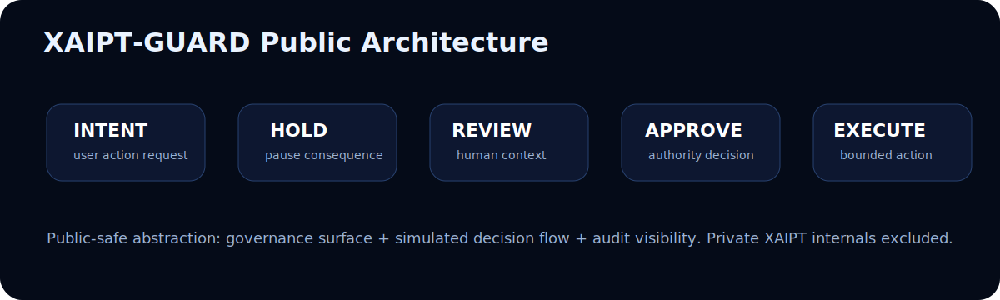

<div align="center">

# XAIPT-GUARD™

### Public Research Edition

## Human Authority Before Irreversible Execution

AI-Era Execution Governance • Runtime Visibility • HOLD-Before-Finality

---


</div>

---

# ⚡ Overview

XAIPT-GUARD™ is a founder-led public research artifact exploring:

- irreversible digital execution
- authority-aware governance
- HOLD-before-finality systems
- bounded consequence runtime models
- AI-era operational trust surfaces

The project demonstrates how high-risk digital actions may move through a governance lifecycle before execution finality is reached.

---

# 🧠 Runtime Governance Lifecycle

```text
REQUEST
   ↓
RISK
   ↓
HOLD
   ↓
REVIEW
   ↓
APPROVE / DENY
   ↓
EXECUTION

This runtime philosophy explores a future where:

delay may become protection
visibility may become security
governance may become runtime-native
HOLD may become a trust primitive
irreversible systems require bounded execution
🎥 Runtime Demonstration
Runtime Intelligence Surface
<a href="./public-demo/assets/videos/xaipt-runtime-intro.mp4">  </a> <p align="center"> Open Runtime Intro Video </p>
HOLD Activation Runtime
<a href="./public-demo/assets/videos/xaipt-hold-activation.mp4">  </a> <p align="center"> Open HOLD Activation Video </p>
Authority Runtime Flow
<a href="./public-demo/assets/videos/xaipt-authority-flow.mp4">  </a> <p align="center"> Open Authority Runtime Video </p>
Audit Runtime Playback
<a href="./public-demo/assets/videos/xaipt-audit-playback.mp4">  </a> <p align="center"> Open Audit Playback Video </p>
🌌 Cinematic Runtime Experience

Open:

public-demo/cinematic/Runtime Experience Engine.html

This cinematic runtime surface demonstrates:

HOLD orchestration
authority graph motion
runtime telemetry
governance visualization
AI-era execution intelligence
bounded consequence modeling
🛡️ What XAIPT-GUARD Demonstrates
Runtime Governance

Visual runtime surfaces showing:

HOLD activation
authority review
execution cooling windows
trust topology
delayed execution simulation
audit playback visibility
operational telemetry
Human-Centered Authority

XAIPT-GUARD explores the philosophy:

Human authority before irreversible execution.

instead of:

Instant irreversible execution by default.

Public-Safe Research Surface

XAIPT-GUARD intentionally exposes only:

governance simulation
runtime visibility
authority topology
audit visualization
execution-flow concepts

while intentionally excluding:

anti-bypass systems
sovereign enforcement layers
distributed vault internals
production transaction logic
private XAIPT mechanisms
XLP / UNI-OS internals
🎨 Runtime Visual Architecture
XAIPT Runtime Hero Surface

Runtime Governance Architecture

🧩 Advanced Diagram Pack

Located inside:

/diagrams

Includes:

runtime governance flow
authority topology
public/private runtime boundary
HOLD → REVIEW → APPROVE orchestration
trust-runtime telemetry visualization
Runtime Governance Flow

Authority Topology

Public / Private Boundary

HOLD → REVIEW → APPROVE

Trust Runtime Telemetry

🚀 Quick Start
Option 1 — Open Directly

Open:

public-demo/index.html

in browser.

Option 2 — Local Runtime Server

Inside repository root:

cd public-demo
python -m http.server 8080

Open:

http://localhost:8080
🎛️ Runtime Modules
Simulated Transaction Pipeline

Visualizes:

request generation
risk escalation
HOLD activation
authority review
delayed execution
bounded execution flow
Risk Engine

Demonstrates:

contextual anomaly pressure
urgency detection
authority mismatch
cooling-window recommendation
Audit Timeline Playback

Shows:

execution transitions
authority checkpoints
review visibility
operational governance chain
Trust Topology

Visual simulation of:

authority graph
HOLD isolation
bounded execution topology
runtime trust visibility
🧭 RBI / Governance Context

XAIPT-GUARD is NOT:

a banking system
a UPI processor
an RBI product
a payment application
a fraud detection engine

This repository exists as a:

Public Research Edition exploring governance concepts around irreversible digital actions.

🌐 Why This Matters

Digital ecosystems increasingly face:

scam pressure
remote manipulation
urgency-driven execution
contextual trust failures
irreversible action chains

XAIPT-GUARD explores whether:

bounded delay
HOLD states
visible authority
review windows
execution cooling layers

may become future governance primitives.

⚙️ Visual Runtime Direction

The runtime surface intentionally aims for:

cinematic runtime feel
operational calmness
premium governance UI
AI-era execution visibility
futuristic telemetry surfaces

while avoiding:

fake hacker visuals
malware aesthetics
exaggerated cyberpunk noise

The goal is:

execution clarity instead of execution chaos.

🧬 Runtime Design Language

XAIPT-GUARD intentionally combines:

governance philosophy
operational runtime design
AI-era telemetry aesthetics
deeptech visualization
human-centered execution flows

into a single public-safe runtime surface.

🛰️ Research Positioning

XAIPT-GUARD should be viewed as:

a runtime governance exploration,

not a traditional cybersecurity tool.

The project intentionally sits between:

cybertech
runtime systems
governance infrastructure
execution intelligence
AI-era trust architecture
🔒 Important Boundary

XAIPT-GUARD intentionally excludes:

production execution capability
financial integrations
transaction processing
bypass-resistant internals
sovereign protection systems
anti-hacker implementation logic

This repository exists as a:

public-safe governance research artifact.

🌌 Final Direction

XAIPT-GUARD explores a future where:

governance becomes runtime-native
HOLD becomes a trust primitive
visibility becomes operational security
delay becomes bounded protection
irreversible execution requires human authority
<div align="center">
XAIPT-GUARD™

Public Research Edition

Human Authority • Runtime Governance • HOLD Before Finality

Founder Research Surface • AI-Era Execution Governance

</div> ```