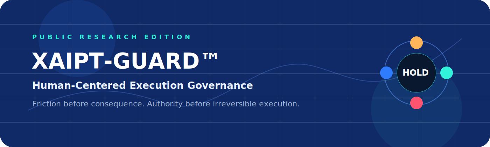
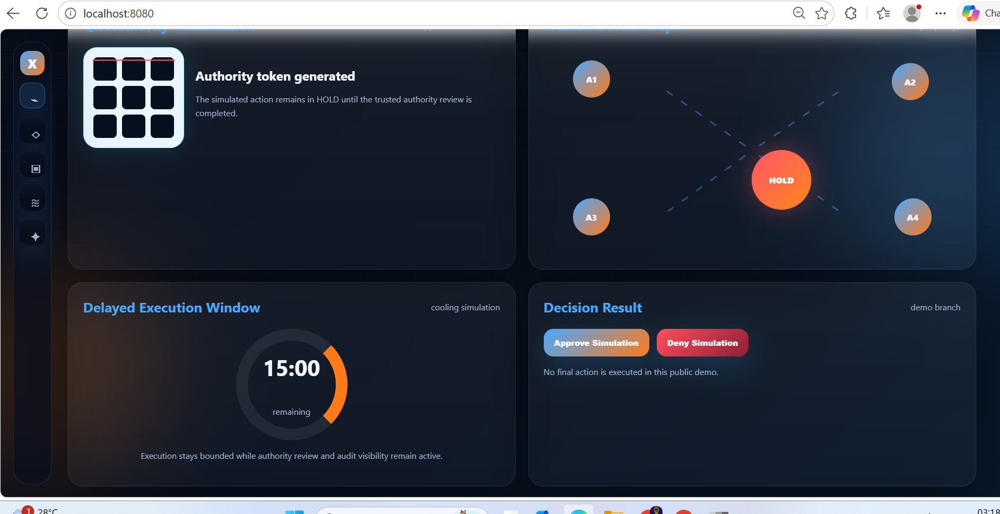
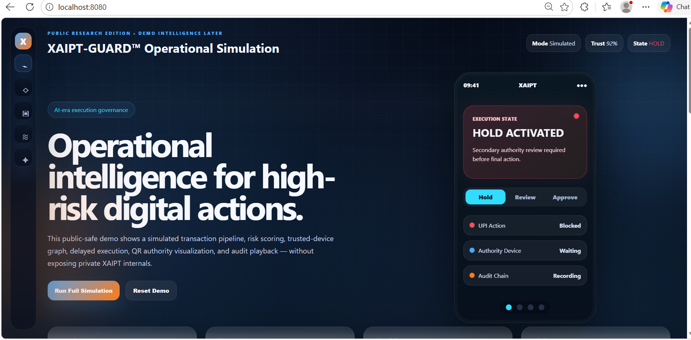
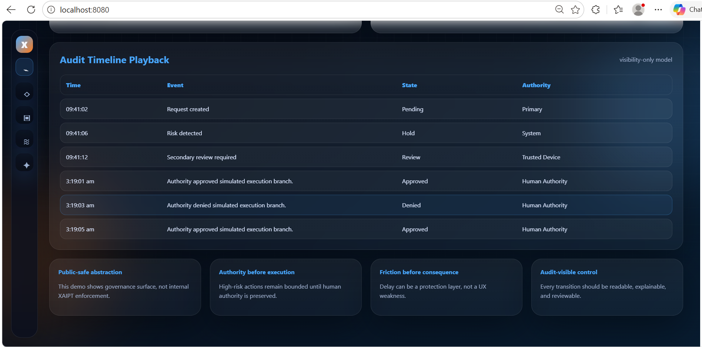

<div align="center">

# XAIPT-GUARD™

### Public Research Edition

## Human Authority Before Irreversible Execution

### AI-Era Execution Governance • Runtime Visibility • HOLD-Before-Finality

---



---

### 🧠 Runtime Governance Research Surface

XAIPT-GUARD™ explores:

### Authority-aware execution • HOLD states • Runtime visibility • Human review before irreversible actions

---

[](https://raajmandale.github.io/XAIPT-GUARD/public-demo/index.html)

&nbsp;

[](https://raajmandale.github.io/XAIPT-GUARD/public-demo/cinematic/runtime-experience-engine.html)

---

### *Delay may become protection. Visibility may become security.*

</div>

---
### XPADI - Releases
XPADI ProofCheck™ v0.3.0 — Recovery Intelligence & Survivability Proof

# ⚡ Overview

XAIPT-GUARD™ is a public-safe governance research artifact exploring:

- irreversible digital execution
- authority-aware runtime systems
- HOLD-before-finality architecture
- delayed execution governance
- AI-era trust surfaces
- bounded consequence computing

---

# 🧠 Runtime Governance Lifecycle

```text
REQUEST
   ↓
RISK
   ↓
HOLD
   ↓
REVIEW
   ↓
APPROVE / DENY
   ↓
EXECUTION
```

---

# 🌌 Core Runtime Philosophy

XAIPT-GUARD explores a future where:

- delay becomes protection
- visibility becomes operational security
- HOLD becomes a trust primitive
- governance becomes runtime-native
- irreversible execution requires human authority

---

# 🎥 Interactive Runtime Experiences

---

### 🚀 Open Main Interactive Runtime

[](https://raajmandale.github.io/XAIPT-GUARD/public-demo/index.html)

---



---

### 🌌 Open Cinematic Runtime Experience

[](https://raajmandale.github.io/XAIPT-GUARD/public-demo/cinematic/runtime-experience-engine.html)

---



---

# 🎬 Runtime Demonstration Modules

---

### 🧠 Runtime Intelligence Surface

### ▶ Open Runtime Intro Video

https://raajmandale.github.io/XAIPT-GUARD/public-demo/assets/videos/xaipt-runtime-intro.mp4

---


---

### 🚨 HOLD Activation Runtime

### ▶ Open HOLD Activation Video

https://raajmandale.github.io/XAIPT-GUARD/public-demo/assets/videos/xaipt-hold-activation.mp4

---


---

### 🛰️ Authority Runtime Flow

### ▶ Open Authority Runtime Video

https://raajmandale.github.io/XAIPT-GUARD/public-demo/assets/videos/xaipt-authority-flow.mp4

---


---

### 📜 Audit Runtime Playback

### ▶ Open Audit Playback Video

https://raajmandale.github.io/XAIPT-GUARD/public-demo/assets/videos/xaipt-audit-playback.mp4

---



---

# 🎨 Runtime Visual Architecture

---

# 🧩 Advanced Diagram Pack

Located inside:

```text
/diagrams
```

---

Includes:

- runtime governance flow
- authority topology
- public/private runtime boundary
- HOLD → REVIEW → APPROVE orchestration
- trust-runtime telemetry visualization

---

### 🧠 Runtime Governance Flow



---

### 🛰️ Authority Topology



---

### 🔒 Public / Private Boundary



---

### 🚨 HOLD → REVIEW → APPROVE



---

### 📡 Trust Runtime Telemetry



---

# 🛡️ What XAIPT-GUARD Demonstrates

---

### 🧠 Runtime Governance

Visual runtime systems showing:

- HOLD activation
- authority review
- delayed execution
- execution cooling windows
- runtime telemetry
- audit visibility
- trust topology
- governance orchestration

---

### 👤 Human-Centered Authority

XAIPT-GUARD explores:

> Human authority before irreversible execution.

instead of:

> Instant irreversible execution by default.

---

### 🌐 Public-Safe Research Surface

This repository intentionally exposes only:

- governance simulation
- runtime visualization
- authority topology
- audit visibility
- execution flow concepts

---

while intentionally excluding:

- anti-bypass systems
- sovereign enforcement layers
- production transaction systems
- private XAIPT internals
- distributed vault logic
- XLP / UNI-OS mechanisms

---

# 🚀 Quick Start

---

### Option 1 — Open Directly

https://raajmandale.github.io/XAIPT-GUARD/public-demo/index.html

---

### Option 2 — Local Runtime Server

```bash
cd public-demo
python -m http.server 8080
```

---

Open:

```text
http://localhost:8080
```

---

# 🎛️ Runtime Modules

---

### 🧠 Simulated Transaction Pipeline

Visualizes:

- request generation
- risk escalation
- HOLD activation
- authority review
- bounded execution flow
- delayed consequence handling

---

### 📊 Risk Engine

Demonstrates:

- urgency pressure
- authority mismatch
- contextual anomaly signals
- cooling-window recommendation

---

### 📜 Audit Timeline Playback

Shows:

- execution transitions
- authority checkpoints
- review visibility
- governance-chain playback

---

### 🌐 Trust Topology

Visual simulation of:

- authority graph
- HOLD-state isolation
- runtime trust visibility
- bounded execution surfaces

---

# 🧭 RBI / Governance Context

XAIPT-GUARD is NOT:

- a banking platform
- a UPI processor
- an RBI product
- a payment application
- a fraud-detection engine

---

This repository exists as a:

> Public Research Edition exploring governance concepts around irreversible digital actions.

---

# 🌌 Why This Matters

Modern ecosystems increasingly face:

- scam pressure
- urgency-based execution
- remote manipulation
- irreversible consequence chains
- contextual trust failures

---

XAIPT-GUARD explores whether:

- bounded delay
- HOLD states
- visible authority
- review windows
- operational visibility

may become future governance primitives.

---

# ⚙️ Runtime Design Language

XAIPT-GUARD intentionally combines:

- cinematic runtime motion
- calm operational UI
- governance clarity
- AI-era telemetry aesthetics
- deeptech visualization
- human-centered interaction

---

while avoiding:

- fake hacker visuals
- malware aesthetics
- fear-based cyberpunk noise

---

# 🛰️ Research Positioning

XAIPT-GUARD should be viewed as:

> a runtime governance exploration,

not a traditional cybersecurity tool.

---

The project intentionally sits between:

- cybertech
- runtime systems
- governance infrastructure
- execution intelligence
- AI-era trust architecture

---

# 🔒 Important Boundary

XAIPT-GUARD intentionally excludes:

- production execution capability
- financial integrations
- transaction processing
- bypass-resistant internals
- sovereign protection systems
- anti-hacker implementation logic

---

This repository exists as a:

> public-safe governance research artifact.

---

# 🌌 Final Direction

XAIPT-GUARD explores a future where:

- governance becomes runtime-native
- HOLD becomes a trust primitive
- visibility becomes operational security
- delay becomes bounded protection
- irreversible execution requires human authority

---

<div align="center">

# XAIPT-GUARD™

### Public Research Edition

### Human Authority • Runtime Governance • HOLD Before Finality

### Founder Research Surface • AI-Era Execution Governance

</div>